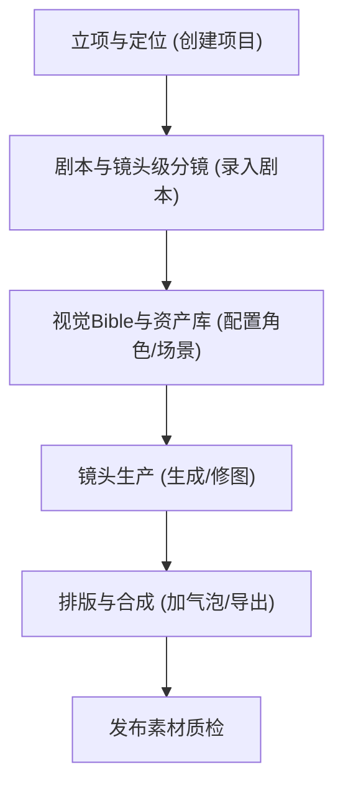

# 1. 产品概述
这是一款面向个人创作者的“AI漫剧工作流平台”，旨在将零散的灵感转化为可复现的流水线作业。
通过整合剧本分镜、资产管理、批量生成和排版合成，帮助创作者稳定地产出静态条漫，并预留动态漫与配音漫剧的升级能力，彻底解决“角色不一致”、“风格漂移”和“返工成本高”的痛点。

# 2. 核心功能

### 2.1 用户角色
| 角色 | 注册方式 | 核心权限 |
|------|----------|----------|
| 个人创作者 | 本地单机使用/账号注册 | 拥有完整的工作流创建、资产库管理和导出权限 |

### 2.2 功能模块
1. **工作台 (Dashboard)**：项目概览、最近编辑的漫剧项目列表。
2. **剧本与分镜 (Script & Storyboard)**：按照“场-镜头”的层级管理剧本，支持结构化的镜头拆解。
3. **资产库 (Asset Library)**：统一管理“角色设定卡”、“场景设定卡”和“提示词模板”。
4. **生产车间 (Production)**：集成提示词组装逻辑，管理每个镜头的生产状态、多版本对比和回退版本。
5. **排版与导出 (Compose & Export)**：多格面板拼接、文案排版、导出为长图格式。

### 2.3 页面详情
| 页面名称 | 模块名称 | 功能描述 |
|----------|----------|----------|
| 首页/工作台 | 项目列表 | 展示所有进行中/已完成的项目卡片，提供“新建漫剧”入口。 |
| 剧本编辑器 | 分镜列表 | 以可视化卡片形式拆解每一个镜头（主体、动作、情绪、场景、对白）。 |
| 资产管理页 | 角色/场景库 | 录入并预览核心角色的设定卡（外形锚点、服装、禁用元素、参考图）。 |
| 生产车间页 | 镜头组装 | 将分镜脚本与资产库关联，自动生成并管理每个镜头的生图记录。 |
| 合成预览页 | 条漫排版 | 拖拽式排列画面，调整气泡框位置，预览最终阅读节奏并导出长图。 |

# 3. 核心流程
创作者在平台上按照 Step-by-step 流程推进，每一关需“验收通过”才能进入下一步，防止整体崩盘。

# 4. 用户界面设计
### 4.1 设计风格
- **主色调与氛围**：暗黑/工作站模式 (Dark Mode)，呈现专业生产力工具的质感（如深灰背景 #121212，强调色使用高饱和度的荧光绿或电光紫，代表AI创造力）。
- **按钮风格**：扁平化+微光晕特效，突出“下一步”和“核心动作”。
- **字体与排版**：中文字体使用 Noto Sans SC / 微软雅黑，英文字体使用 JetBrains Mono（增强参数与代码的极客感）。
- **布局风格**：典型的三栏式生产力布局（左侧导航，中间画布/列表，右侧属性面板）。

### 4.2 页面设计概览
| 页面名称 | 模块名称 | UI 元素 |
|----------|----------|---------|
| 工作台 | 项目卡片 | 封面图、项目名称、当前进度条、创建时间、深色毛玻璃卡片样式 |
| 剧本编辑器 | 分镜卡片流 | 瀑布流/纵向时间轴布局，每个卡片包含标签（近景/特写）、状态（待生成/已完成） |
| 生产车间 | 参数与图库 | 左侧为该镜头的提示词参数区，右侧为生成的九宫格备选图，支持选中并设为“定稿” |

### 4.3 响应式设计
- **优先桌面端 (Desktop-first)**：作为生产力工具，以PC端宽屏体验为主，支持快捷键操作。
- 移动端仅提供“项目浏览”和“进度查看”的只读模式，不开放复杂的编辑功能。
