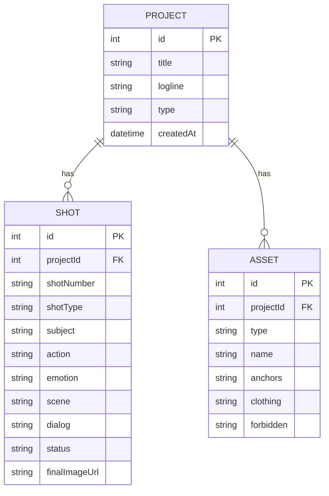

# 1. 架构设计
```mermaid
graph TD
    A[前端: Vue 3 + Tailwind CSS] --> B[API 层: Axios]
    B --> C[后端: Node.js (Express)]
    C --> D[数据层: SQLite]
    C --> E[外部服务: 预留 AI 生图 API 接口 (可选)]
```

# 2. 技术说明
- **前端框架**：Vue 3 (Composition API) + Vite 构建
- **前端路由**：Vue Router
- **状态管理**：Pinia
- **UI 组件与样式**：Tailwind CSS + Headless UI 或自定义组件
- **后端框架**：Node.js (Express) + CORS
- **数据库 ORM**：Sequelize 或 Prisma (推荐 Prisma + SQLite 方便本地快速启动)
- **图表/流程图**：Mermaid.js (若需在前端展示)
- **其他依赖**：Multer (用于本地文件/图片上传存储)

# 3. 路由定义 (前端)
| 路由 | 用途 |
|------|------|
| `/` | 首页工作台 (项目列表) |
| `/projects/:id` | 漫剧项目主控制台 (分段流程入口) |
| `/projects/:id/script` | 剧本与分镜编辑器 |
| `/projects/:id/assets` | 资产库 (角色/场景/提示词模板) |
| `/projects/:id/production` | 镜头生产车间 |
| `/projects/:id/compose` | 合成与排版预览 |

# 4. API 定义 (后端)
```typescript
// 项目 API
GET /api/projects
POST /api/projects (body: { title, type, logline })
GET /api/projects/:id

// 剧本分镜 API
GET /api/projects/:id/shots
POST /api/projects/:id/shots (body: { shotNumber, type, subject, action, emotion, scene, dialog })
PUT /api/shots/:shotId

// 资产库 API
GET /api/projects/:id/assets
POST /api/projects/:id/assets (body: { name, type, anchors, clothing, forbidden })

// 镜头生产状态 API
PUT /api/shots/:shotId/status (body: { status, imageUrl })
```

# 5. 服务器架构图
```mermaid
graph LR
    A[Express Router] --> B[Controllers]
    B --> C[Services (业务逻辑处理)]
    C --> D[Prisma Client (ORM)]
    D --> E[(SQLite Database)]
```

# 6. 数据模型
### 6.1 数据模型定义


### 6.2 数据库模式 (Prisma Schema 示例)
```prisma
model Project {
  id        Int      @id @default(autoincrement())
  title     String
  logline   String?
  type      String   @default("STATIC")
  createdAt DateTime @default(now())
  shots     Shot[]
  assets    Asset[]
}

model Shot {
  id            Int      @id @default(autoincrement())
  projectId     Int
  project       Project  @relation(fields: [projectId], references: [id])
  shotNumber    String
  shotType      String?
  subject       String?
  action        String?
  emotion       String?
  scene         String?
  dialog        String?
  status        String   @default("PENDING")
  finalImageUrl String?
}

model Asset {
  id          Int      @id @default(autoincrement())
  projectId   Int
  project     Project  @relation(fields: [projectId], references: [id])
  type        String   // ROLE, SCENE, PROP
  name        String
  anchors     String?
  clothing    String?
  forbidden   String?
}
```
